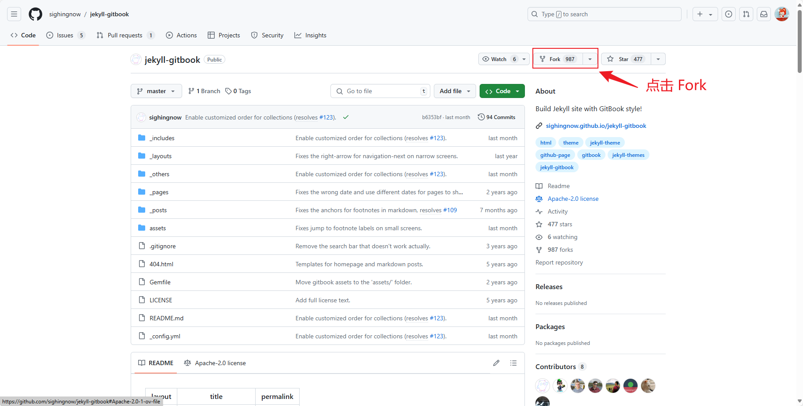
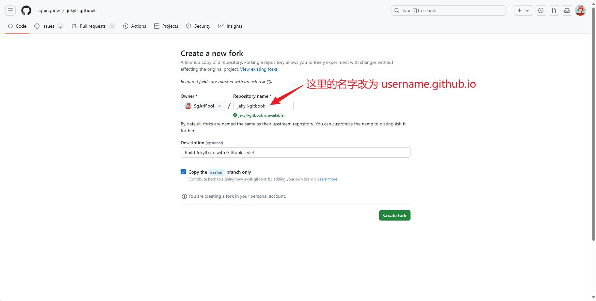

###### 本文只是记录了参考其它大佬的教程, 搭建出自己博客的流程

<!-- more -->

## 1 Github 部分 [^1] [^2]

#### 1.1 新建一个 GitHub 仓库

博客是基于 GitHub 的 Page 功能来实现的, 所以一个 GitHub 账号是必不可少的, 可以自行去 [GitHub 官网](https://github.com)注册一个

注册好 GitHub 账号后, 建立一个名为 `username.github.io` 的仓库 (使用这个名字, 之后可以直接通过 `https://username.github.io` 访问自己的博客)

你可以通过 fork 其他大佬的博客的博客仓库迅速搭建起自己博客的框架, 比如 参考连接[^1] [^2] 里两位大佬的博客, 由于这些博客都是使用 Jekyll 来生成的静态网站的, 所以如果你希望使用其它主题, 也可以到 [这个网站](http://jekyllthemes.org/) 里, 寻找一个自己喜欢的主题, 进入主题的 GitHub 仓库里, fork 这些主题, 在这些主题的基础上, 继续自己博客的建设

简单介绍一下如何 fork, 以 gitbook 主题为例, 进入主题仓库, 点击右上方的 Fork 按钮



然后将更改仓库的名字, 最后点击 Create fork, 完成创建



注意 `username` 指的是用户名不是昵称, `username` 是大小写不敏感的, 个人建议全部小写就行


### 1.2 修改仓库文件

如果这时你在浏览器网址一栏搜索你刚刚建立的仓库名 `username.github.io` , 会发现已经可以看到初步的博客框架已经成型, 但是上面显示的内容都还只是模板默认的内容, 所以我们需要通过修改仓库根目录下的 `README.md, _config.yml` 等文件, 来添加和我们自己有关的信息

#### 1.2.1 修改 `README.md` 文件

`README.md` 文件是对仓库的说明, 一般来说第一行标题都是仓库名称, 后面是仓库的介绍 (理论上来说, 这个可以不填) 要填可以参考如下

```markdown

# sgarifool.github.io

My Personal Blog via GitHub

创建流程参考: https://pianfan.github.io/build_own_website/

```

#### 1.2.2 修改 `_config.yml` 文件

`_config.yml` 文件是博客网站的核心配置文件, 通过修改这个文件里的信息, 来更改网站的大框架里显示的信息

**网站名称和网站描述**


这个根据你自己的喜好来设置，不一定要仿造我的模式。比如你可以给你的博客网站取一个好听点的名字，网站描述也可以是简短的自我介绍或个性签名等任何你想表达的内容。

**个人头像和网站 logo**


avatar 代表头像，后面的链接是你想显示在页面的头像图片的 url。favicon 指网站图标，即显示在浏览器标签页和收藏夹里的 logo，通常以 32 * 32 像素大小的 .ico 图片为宜，也可以不设置。

**个人社交链接** 


填用户名就可以，没有的就不填。

**脚注和网址**


#### 1.2.3 删除 `_posts` 文件夹并重建

`_posts` 文件夹里放的是博客文章, 直接 fork 过来后里面的文章要么是其他人的文章, 要么是主题的说明, 整个删除后加入自己的文章就可以了

#### 1.2.4 修改 about.md文件

`about.md` 里的内容是展示在“关于”页面上的。

好了，以上就是所有必须要你修改的文件。你现在再点进去你的博客页面看看，不出意外的话应该是成功修改了的。

### Step 3. 开始写你的第一篇文章

在 `README.md` 部分我有提到过怎么在 github 上编写 Markdown 文件，写文章也是一样的道理。

文章文件的命名也是有讲究的，请按照下面的例子呈现的格式命名：

2024-1-25-letter_to_you.md
2024-1-26-user_manual.md

还有一点需要注意，每篇文章开头记得附上说明，格式如下：

---

layout: post
title: "文章标题"
date:   2024-1-27
tags: [tag1, tag2]
comments: true
author: xxx

---

- date 是写作日期，注意格式必须遵守 `YYYY-MM-DD` 才可以。

- tags 是文章标签，可以有一个或多个。

---

感谢阅读！

## 2. Jekyll 部分 [^3] [^4] [^5]

上面只是完成了最简单的博客的搭建, 虽然博客的内容可以使用常规的 MarkDown 语法, 但是如果我写的博客里涉及到数学公式, 或者希望显示一些流程图, 上述模板是不够用的, 所以需要修改部分Jekyll的代码, 来添加对 Latex 和 Mermaid 的支持

(本来这里是打算写一些配置的, 但是发现有的主题在 fork 之后自己就自带这些功能, 所以偷一下懒, 先放在这里了, 感兴趣的话可以看看我贴出来的链接)

---

## 参考文献

[^1]: [https://pianfan.github.io/build_own_website](https://pianfan.github.io/build_own_website)

[^2]: [https://arnold117.github.io/github_pages/](https://arnold117.github.io/github_pages/)

[^3]: [https://blog.csdn.net/m0_64012205/article/details/121265345](https://blog.csdn.net/m0_64012205/article/details/121265345)

[^4]: [https://www.jianshu.com/p/aa359b3aef0](https://www.jianshu.com/p/aa359b3aef0)

[^5]: [https://jackgruber.github.io/2021-05-09-Embed-Mermaid-in-Jekyll-without-plugin/](https://jackgruber.github.io/2021-05-09-Embed-Mermaid-in-Jekyll-without-plugin/)
