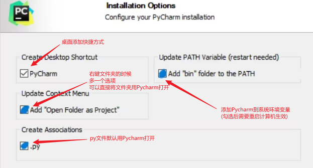
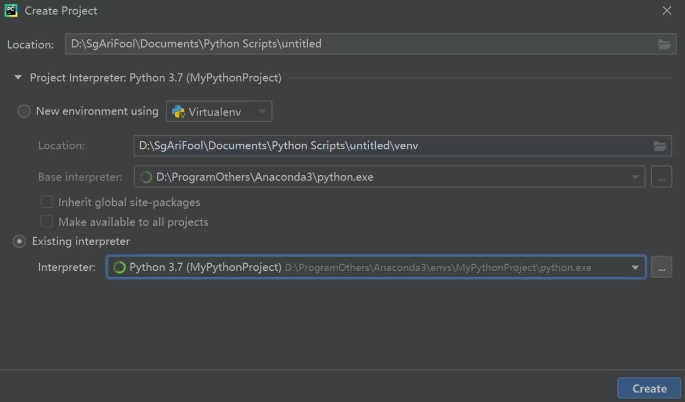

> 本文记录了在 Windows 上安装 Anaconda 和 Pycharm, 并且在 Pycharm 项目里配置 Anaconda 环境的过程

<!-- more -->

#### 写在前面的话

本文参考了一篇 [CSDN 的博文](https://blog.csdn.net/m0_51210142/article/details/119118246), 起因是今年2月份, 在使用新电脑配置 anaconda 的 python 环境和 pycharm 并联的时候一些重要部分忘记了, 希望回看那篇博文发现被 CSDN 列入了 vip 文章, 之前收藏这篇文章的时候, 文章还是全文免费, 可以随便查阅的, 翻了一下博主的主页, 发现他2022年之后就再也没有发布过任何文章, 经搜索发现 CSDN 也有无缘无故将一些文章在作者不知情的情况下列入 vip 文章的先例 (对 CSDN 的反感又加深嘞), 在通过 CSDN 私信原作者无果后 (估计原作者已经不玩 CSDN 了) 决定自己搜罗资料重新整理一份 (如今游客身份已经只能看到这篇文章的开头了捏), 将原文作者的前言贴在下方吧 (真实讽刺啊)

> 手动装了两次 anaconda 和 pycharm 并联，多少有点心得，这里记录一下，方便后面再装时可以查阅。

---

#### 1 Anaconda的安装 (版本自己选择, 目前自己用的是 Anaconda3-2018.12-Windows-x86_64)

网上已经有非常详细的教程，具体可以参考 [这个链接](https://zhuanlan.zhihu.com/p/358641541)

安装包可以在 [清华大学开源软件镜像站](https://mirrors.tuna.tsinghua.edu.cn/anaconda/archive) 获取

在安装anaconda的时候主要有两点需要注意

1. 一开始不要勾选自动添加环境变量, 之后自己手动添加
2. Anaconda 的安装路径不仅要保证全部是英文, 还要注意安装的路径不能有空格 (space)

---

#### 2 Pycharm 的安装 (版本自己选择, 目前本人用的是 pycharm-community-2019.3.5)

pycharm 的安装网上也有非常多的教程, 想用破解版可以自己去搜索微信公众号, 一般都有全套的安装教程, 这里描述的是一个社区版本的安装

1. 去 [官网](https://www.jetbrains.com/pycharm/download/other.html) 找到自己想要的社区版本并且下载对应的 exe 版本
2. 双击下载的exe文件, 点击 Next (下一步)
3. 修改安装路径 (这里我的做法是直接将最前面的盘符由 C 改为 D, 可以选择自己喜欢的地方安装), 点击 Next (下一步)
4. 可以只勾第一个, 其它按需勾选, 完成后, 点击 Next (下一步)
   
5. 后面一直点击 Next (下一步) 即可

---

#### 3 Anaconda 与 Pycharm 的并联

1. 在 Anaconda 里, 新建一个自己的 python 环境 (方便以后删库跑路)[^1]
```bash
   # 创建一个自己的 python 环境
   # env_name:   为自己新环境的名字
   # python=3.6: 为新环境 python 的版本
   conda create -n env_name python=3.6
   
   # 其它操作可以自行查看参考链接
   # 注意：新建的环境一般在"Anaconda3\envs\env_name"这个文件夹下, 里面有一个 python.exe 文件
```
2. 新建一个存放新项目的文件夹, 位置自己选就可以了
3. 在 Pycharm 里新建一个 project, 文件夹选择刚刚新建的文件夹, 并且在下方选择自己在第1步新建的 python 环境 (选中"Anaconda3\envs\env_name"文件夹下的 python.exe 文件)   
4. 点击 create 就可以将这两个东西并联起来

之后给自己的 python 环境安装第三方库有两种方法: conada 和 pip

步骤如下: 

```shell
# 查看目前有哪些环境
conda env list

# 激活某个环境
activate env_name

# 使用conda install 或者 pip install来安装依赖包
conda install
pip install
```

他们的区别如下: 

- conda install 可以安装任何语言的包, 而 pip install 只能安装 Python 的包
- conda install 可以创建和管理隔离的环境, 而 pip install 需要依赖其他工具, 如 virtualenv 或 venv
- conda install 可以安装二进制文件, 不需要编译器, 而 pip install 可能需要编译器来安装源码包
- conda install 可以检查所有包的依赖关系, 保证环境的可用性, 而 pip install 可能导致环境被破坏或冲突
- conda install 安装的包都放在 anaconda3/pkgs 目录下, 可以复用, 而 pip install 安装的包放在不同的环境中, 可能重复下载

#### 参考文献

[^1]: [https://www.jianshu.com/p/663eea2c6f8f](https://www.jianshu.com/p/663eea2c6f8f)
