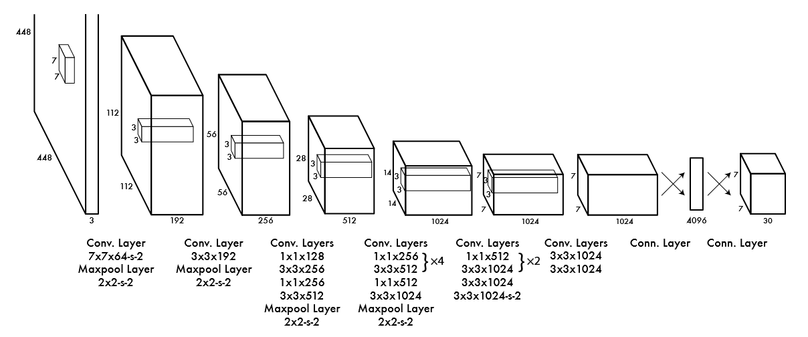
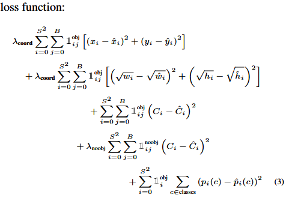
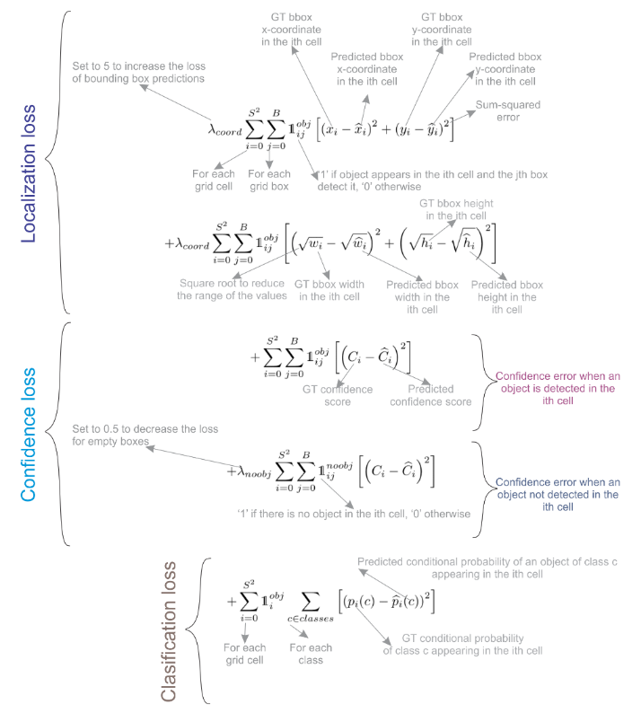

> 笔记介绍了 YOLOv1 的部分实现细节, 以及 YOLOv1 的损失是如何计算的

<!-- more -->

## 模型结构介绍

先放代码 (代码来自豆包)

```python
import torch
import torch.nn as nn
import torch.nn.functional as F

class YOLOv1(nn.Module):
    def __init__(self, S=7, B=2, C=20):
        super(YOLOv1, self).__init__()
        self.S = S  # 网格数
        self.B = B  # 每个网格预测的边界框数
        self.C = C  # 类别数
        
        # 骨干网络（简化版）
        self.conv_layers = nn.Sequential(
            # 第一层
            nn.Conv2d(3, 64, kernel_size=7, stride=2, padding=3),
            nn.LeakyReLU(0.1),
            nn.MaxPool2d(kernel_size=2, stride=2),
            
            # 第二层
            nn.Conv2d(64, 192, kernel_size=3, padding=1),
            nn.LeakyReLU(0.1),
            nn.MaxPool2d(kernel_size=2, stride=2),
            
            # 第三层
            nn.Conv2d(192, 128, kernel_size=1),
            nn.LeakyReLU(0.1),
            nn.Conv2d(128, 256, kernel_size=3, padding=1),
            nn.LeakyReLU(0.1),
            nn.Conv2d(256, 256, kernel_size=1),
            nn.LeakyReLU(0.1),
            nn.Conv2d(256, 512, kernel_size=3, padding=1),
            nn.LeakyReLU(0.1),
            nn.MaxPool2d(kernel_size=2, stride=2),
            
            # 第四层
            nn.Conv2d(512, 256, kernel_size=1),
            nn.LeakyReLU(0.1),
            nn.Conv2d(256, 512, kernel_size=3, padding=1),
            nn.LeakyReLU(0.1),
            # 重复卷积块...
            nn.Conv2d(512, 1024, kernel_size=3, padding=1),
            nn.LeakyReLU(0.1),
            nn.MaxPool2d(kernel_size=2, stride=2),
            
            # 第五层
            nn.Conv2d(1024, 512, kernel_size=1),
            nn.LeakyReLU(0.1),
            nn.Conv2d(512, 1024, kernel_size=3, padding=1),
            nn.LeakyReLU(0.1),
            nn.Conv2d(1024, 1024, kernel_size=3, padding=1),
            nn.LeakyReLU(0.1),
            nn.Conv2d(1024, 1024, kernel_size=3, stride=2, padding=1),
            nn.LeakyReLU(0.1),
            
            # 第六层
            nn.Conv2d(1024, 1024, kernel_size=3, padding=1),
            nn.LeakyReLU(0.1),
            nn.Conv2d(1024, 1024, kernel_size=3, padding=1),
            nn.LeakyReLU(0.1),
        )
        
        # 全连接层
        self.fc_layers = nn.Sequential(
            nn.Linear(1024 * S * S, 4096),
            nn.LeakyReLU(0.1),
            nn.Dropout(0.5),
            nn.Linear(4096, S * S * (C + B * 5))
        )
    
    def forward(self, x):
        # 确保输入图像尺寸为448×448
        x = F.interpolate(x, size=(448, 448), mode='bilinear', align_corners=False)
        
        # 特征提取
        x = self.conv_layers(x)
        
        # 重塑张量
        x = x.view(x.size(0), -1)
        
        # 全连接层预测
        x = self.fc_layers(x)
        
        # 重塑为 [batch_size, S, S, C + B*5]
        x = x.view(-1, self.S, self.S, self.C + self.B * 5)
        return x

# 创建模型实例
def create_yolov1_model():
    """创建YOLOv1模型实例"""
    model = YOLOv1(S=7, B=2, C=20)
    return model

# 测试模型
if __name__ == "__main__":
    model = create_yolov1_model()
    x = torch.randn(1, 3, 448, 448)  # 输入图像
    output = model(x)
    print(f"输出形状: {output.shape}")  # 应输出 (1, 7, 7, 30)
```

结合 YOLOv1 论文的图片来对应分析



下面是从一篇综述里爬出来的 YOLOv1 的结构表: 

|     | Type        | Filters | Size/Stride | Output  |
| --- | ----------- | ------- | ----------- | ------- |
|     | Conv        | 64      | 7×7/2       | 224×224 |
|     | Max Pool    |         | 2×2/2       | 112×112 |
|     | Conv        | 192     | 3×3/1       | 112×112 |
|     | Max Pool    |         | 2×2/2       | 56×56   |
| 1×  | Conv        | 128     | 1×1/1       | 56×56   |
|     | Conv        | 256     | 3×3/1       | 56×56   |
|     | Conv        | 256     | 1×1/1       | 56×56   |
|     | Conv        | 512     | 3×3/1       | 56×56   |
|     | Max Pool    |         | 2×2/2       | 28×28   |
| 4×  | Conv        | 256     | 1×1/1       | 28×28   |
|     | Conv        | 512     | 3×3/1       | 28×28   |
|     | Conv        | 256     | 1×1/1       | 28×28   |
|     | Conv        | 512     | 3×3/1       | 28×28   |
|     | Conv        | 256     | 1×1/1       | 28×28   |
|     | Conv        | 512     | 3×3/1       | 28×28   |
|     | Conv        | 256     | 1×1/1       | 28×28   |
|     | Conv        | 512     | 3×3/1       | 28×28   |
|     | Conv        | 512     | 1×1/1       | 28×28   |
|     | Conv        | 1024    | 3×3/1       | 28×28   |
|     | Max Pool    |         | 2×2/2       | 14×14   |
| 2×  | Conv        | 512     | 1×1/1       | 14×14   |
|     | Conv        | 1024    | 3×3/1       | 14×14   |
|     | Conv        | 512     | 1×1/1       | 14×14   |
|     | Conv        | 1024    | 3×3/1       | 14×14   |
|     | Conv        | 1024    | 3×3/2       | 7×7     |
|     | Conv        | 1024    | 3×3/1       | 7×7     |
|     | Conv        | 1024    | 3×3/1       | 7×7     |
|     | FC          | 4096    |             | 4096    |
|     | Dropout 0.5 |         |             | 4096    |
|     | FC          |         |             | 7×7×30  |

表里的 Filters 就是卷积核的个数, 也就是输出的通道数

### 详细介绍一下输入的第一次处理

从上面可以看到, 原始输入的图像是 `448*448*3` 的形状, 通道数可以不用管反正输出通道数只由卷积核个数决定, 那么 `448*448 --> 224*224`  是如何实现的呢

从代码可以看出, 第一个卷积层是

```python
nn.Conv2d(3, 64, kernel_size=7, stride=2, padding=3)
```

这样的, 而输出的形状可以由下面的公式计算 (我们只讨论一般的长宽相等的卷积核)

$$
H_{out} = \left\lfloor \frac{H_{in} + 2p - k}{s} \right\rfloor + 1
$$

核心参数：
- 输入高度: 通常表示为 $H_{in}$
- 卷积核 (滤波器): 大小为 $(k, k)$ 
- 步长 (stride): 卷积核移动的步长，通常为 $s$ 
- 填充 (padding): 在输入图像边缘添加的像素数，通常为 $p$ 

带入公式: 

$$
H_{out} = \frac{448 + 2*3 - 7}{2} + 1
$$

发现好像有点不对, 前面的那一部分也不能被 2  整除啊 (不是

其实这里需要了解到 $\left\lfloor \dots \right\rfloor$ 这个符号其实是 **向下取整** 的意思, 因为卷积核按照步长来移动计算, 但是如果遇到最后一个步长不够走的时候 (比如步长为2, 但是最后只剩1格给你走, 那么这次就不要了), 豆包有一个图形化的解释: 

```text
输入: [x₁, x₂, x₃, x₄, x₅, x₆, x₇, x₈, x₉]
卷积核: [k₁, k₂, k₃] (k=3)
步长: s=2

移动过程:
1. [x₁, x₂, x₃] ✅
2.       [x₃, x₄, x₅] ✅
3.             [x₅, x₆, x₇] ✅
4.                   [x₇, x₈, x₉] ✅
5.                         [x₉, ?, ?] ❌ （无法完全覆盖，丢弃）
```

### 再详细介绍一下模型的最后几步

数据在经过一系列操作之后, 会得到 `7*7*1024` 这样的形状, 然后这里它引入了一个 `4096` 的全连接层, 也就是说首先对 `7*7*1024` 进行了展平操作, 变成一个 `50176` 大小的一维向量, 然后映射到 `4096` 再映射到 `7*7*(2*5+20) = 1470`, 最后对这个 `1470` 大小的一维向量重塑为 `7*7*30` 的形状

> 解释一下: 这里的 `7*7*(2*5+20)` 表示, 最后相当于把图片分成了 `7*7` 大小, 每一块预测 `2` 个边缘框, 边缘框的 `5` 个信息 (位置2, 大小2, 置信度1), 模型能识别的类型个数为 `20` 

我们发现这里的最后有一个展平, 然后再重塑的过程, 那这一展平不就还是丢失空间信息了吗, 不过这里只是早期的 YOLO 特有的, 到 YOLOv3+ 之后会: 直接通过卷积层输出预测, 完全保留显式空间信息

## 损失介绍

YOLOv1 的损失一共分为 5 个式子做加和得到: 



前两项都是位置损失, 第一个表示的是中心点画的准不准, 第二个表示框的宽和高画的对不对, 第三个是有目标的置信度损失, 第四个是无目标的置信度损失, 第五个表示的是类别分的对不对

前 2 个, 可以看成是一个回归问题, 可以使用 L2_loss 之类的, 最后 1 个, 可以看成是一个分类问题, 可以使用 cross-entropy loss (交叉熵损失)

而中间 2 个, 有关置信度的

---

在YOLOv1中，每个边界框的 **置信度** 定义为：

$$
\text{Confidence} = Pr(Object) \times IOU_{pred}^{truth}
$$

- $Pr(Object)$：表示边界框内存在目标的概率。
- $IOU_{pred}^{truth}$：预测框与真实框的交并比（Intersection over Union）

**有目标的置信度损失**

$$
\sum_{i=0}^{S^2} \sum_{j=0}^{B} \mathbb{1}_{ij}^{obj} (C_i - \hat{C}_i)^2
$$

- **作用**：对于负责检测目标的边界框，惩罚其置信度与真实IOU的偏差。
- **目标值**：$C_i = IOU_{pred}^{truth}$（理想情况下，预测框与真实框完全重合，IOU=1）。

**无目标的置信度损失**

$$
\lambda_{noobj} \sum_{i=0}^{S^2} \sum_{j=0}^{B} \mathbb{1}_{ij}^{noobj} (C_i - \hat{C}_i)^2
$$

- **作用**：对于不包含目标的边界框，惩罚其高置信度预测（即抑制虚假检测）。
- **目标值**：$C_i = 0$（因为没有目标，理想置信度为0）。
- **权重**：$\lambda_{noobj}=0.5$，降低无目标框的损失权重（大多数网格不包含目标）。

**YOLOv1**：使用均方误差（MSE）计算置信度损失，区分有目标和无目标。
**YOLOv2及以后**：引入 **逻辑回归** 处理置信度预测，并使用 **Objectness Score** 显式表示目标存在概率，进一步优化了正负样本不平衡问题。

---



## 参考文献

[1] REDMON J, DIVVALA S, GIRSHICK R, et al. You Only Look Once: Unified, Real-Time Object Detection[A/OL]. arXiv, 2016[2024-04-19]. http://arxiv.org/abs/1506.02640.

[2] TERVEN J, CORDOVA-ESPARZA D. A Comprehensive Review of YOLO Architectures in Computer Vision: From YOLOv1 to YOLOv8 and YOLO-NAS[J/OL]. Machine Learning and Knowledge Extraction, 2023, 5(4): 1680-1716. DOI:10.3390/make5040083.
