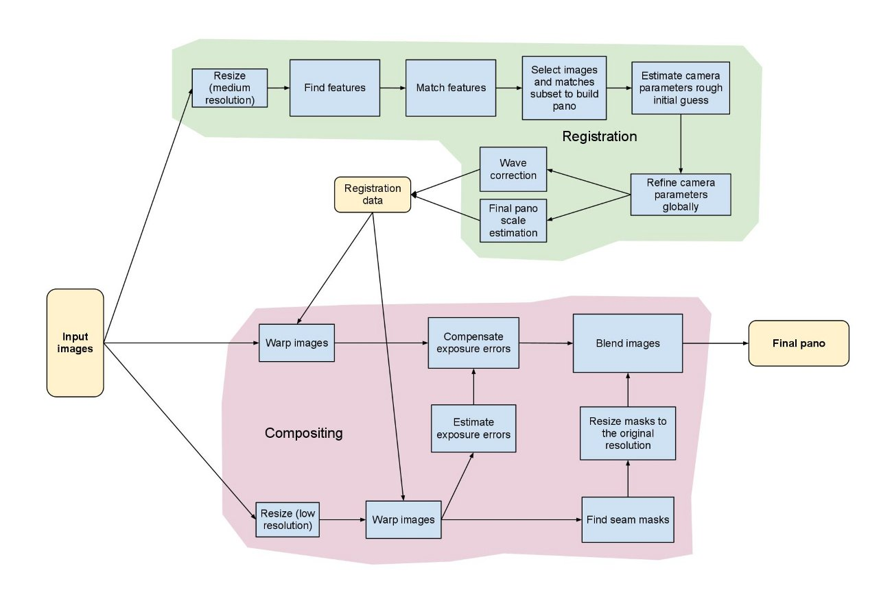
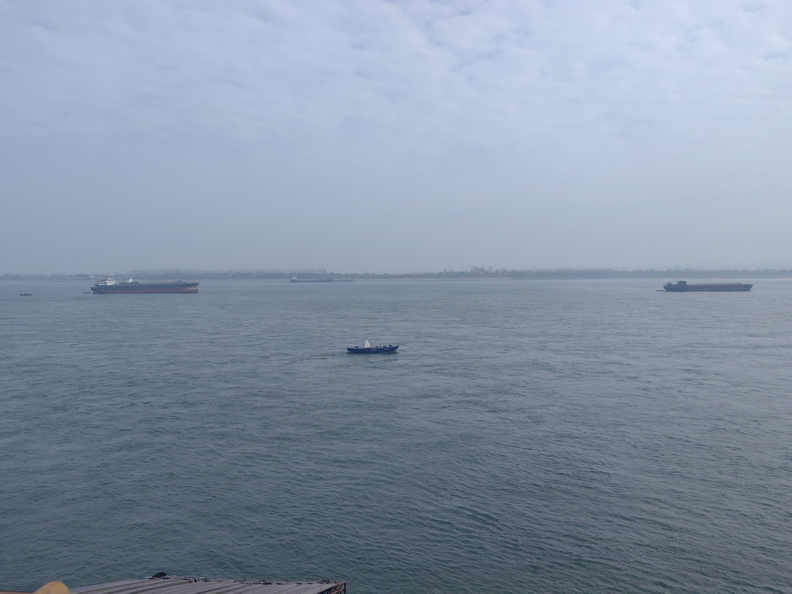
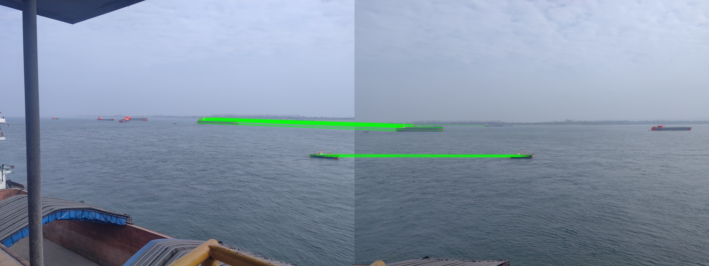
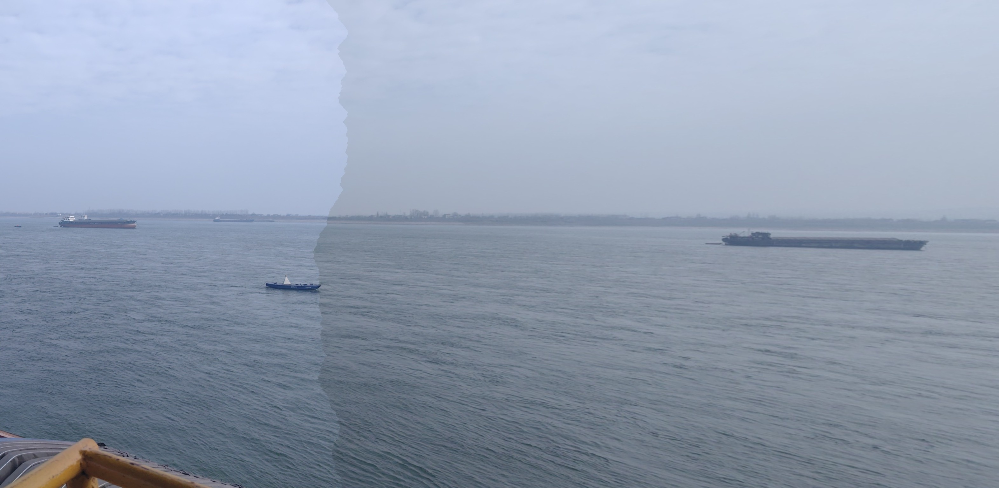

> 一年多前, 我写了一篇类似的文章, 但是前段时间写大论文的时候发现其实之前写的 blog 就是依托, 所以这篇笔记我打算整个重新梳理一遍 opencv 的 stitch 的底层到底在干什么

<!-- more -->

## 概述

先还是放我之前那个博客的图: (我直接用官方的那个图吧)

(写的时候忽然看到一篇博客还不错, 连接在 [这里](https://zhuanlan.zhihu.com/p/604500203) 可以去看看, 但是注意, 他图片里的翻译是有点问题的, **Registration** 应该是 **配准** 的意思, 他机翻成了注册, 就很怪)

其实一开始看这个图, 可能有点不知道这个图到底在干嘛, 一开始我也很懵逼. 但是其实这个给图已经写的很清楚了, 只是我们一开始不知道 `image_stitch` 到底需要干什么, 不知道每一个步骤背后的含义, 所以看起来感觉这张图片不明所以

图片里画的很清楚, 图片拼接其实就分两个大的步骤, **图片的配准** 和 **图片的融合**. 图中绿色的部分所展示的东西, 就是图片的配准, 粉色的部分就是图片的融合

下面会详细讲一下这两个部分是如何工作的, 都会先讲一下原理, 然后结合上面的图来讲他的技术路线, 和原理的对应关系

我们后面的终极目标是, 用两张图片的柱面投影模型, 来完成图片的拼接 (都是硕士毕业论文逼的)

## 图像配准

`image_stitch` 的本质, 是在找两个图像之间像素的关系, 图像配准就是在干这个事情, 找到两张图像像素点之间的关系

任意两个平面之间的映射关系, 都可以用单应性矩阵 $H$ 来描述, 我们完全可以通过计算 $H$ 的方法, 先大概来看看, 这两张图片的关系到底是什么样的

#### 计算两张图像的单应性矩阵

先来看看单应性矩阵长什么样子吧: (关于单应性矩阵的物理含义, 可以看 [这个博客](https://zhuanlan.zhihu.com/p/74597564) )

$$
H = \begin{bmatrix}
h_{00}  & h_{01} & h_{02}\\
h_{10}  & h_{11} & h_{12}\\
h_{20}  & h_{21} & h_{22}
\end{bmatrix}
$$

看着是有 9 个参数需要求解, 但是实际上 $h_{22}$ 位置的参数是缩放因子, 一般都会归一化成 1. 所以实际需要求解的参数其实是 8 个. 一组对应的点对只能提供两组方程, 所以解这 8 个参数, 就至少需要 4 组点对.

但是在实际求解中, 我们其实会找很多组点对. 首先就需要确定特征点吧, 于是现在就到了大家可能都已经听烂了的 SIFT, ORB 之类的特征提取算法了, 这些算法的原理我就不赘述了, 不懂的可以自行搜索, 或者问问 AI. 现在我们只需要知道这些算法在通过一些特定的方式, 来在图片中找到一些不变的东西, 并且使用一些方法来描述这些特征, 可能一个点的特征用一个 128 维的向量来描述之类的. 有了一个点的特征描述, 那么就在这两幅图片之间通过计算这种描述的相似性, 来确定这来自这两幅图的特征点是否是同一个特征, 进而就可以建立特征点对, 然后计算两幅图片之间的 $H$ 了, 芜湖

来举个栗子吧: 

  <figure style="margin: 0; width: 48%; text-align:center;">
    
    <figcaption>左侧视角图片</figcaption>
  </figure>
  <figure style="margin: 0; width: 48%; text-align:center;">
    
    <figcaption>右侧视角图片</figcaption>
  </figure>

然后我们来看看上面的两个图片, 通过 SIFT 算子提取特征并匹配之后大概是什么样子的, 我们将两个匹配的点用绿色的先连接起来之后如下所示: 

注意哦, 这里的特征匹配是经过粗匹配以及精匹配之后 (这里会涉及到 K 近邻搜索, 比值校验, RANSAC 算法, 也可以自行搜索, 或者问问 AI, AI 还是太好用了哥们) 的结果, 所以看起来非常不错, good, 这一步通过 RANSAC 就已经从这么多点对里计算出一个相对合理的 $H$ 啦

#### 如果我们直接使用这个 $H$ 会发生什么

一般如果我们让 AI 给我们写一个图片拼接逻辑, 它大概会在计算出 $H$ 之后, 就直接使用这个 $H$, 计算一个图片到另一个图片映射后的样子, 然后直接拼接, 让我们来看看, 这种直接拼接的效果是什么样子的: 

这里我也让 AI 帮我写了一点 trick, 用了最佳缝合线 (这个可以自行了解一下, 概念还是很简单的, 不懂就问 AI 吧, くくく) 的方式来拼接两幅图片, 可以看到, 这里是将右边这张图片的像素点 "映射" 到了左边图片的空间中. 有没有发现, 左边的船看起来正常, 但是右边的船变长了, 看起来怪别扭的 (难看就对了, 说明直接计算这种方法是不大对的)

#### 单应性矩阵的正确使用方式

既然不能直接用, 那么我们应该怎么用呢, 这个时候就需要涉及到一些更基础一些的东西了, 比如, 相机是如何成像的之类的

我在论文中如是写到: "然而，单应矩阵本质上描述的是两幅图像之间的平面射影关系，当场景存在明显深度差异或相机存在平移分量时，仅仅靠单应矩阵难以精确刻画所有空间点的投影关系。为实现结构一致且几何连续的全景图像构建，需要进一步估计相机参数，将图像间的几何关系转化为统一的相机姿态模型，从而建立全局一致的投影框架。"

(博客施工中 ... )

## 参考文献

